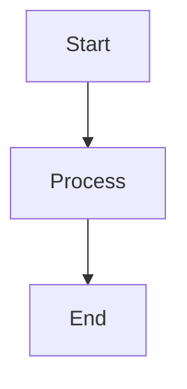

# 🎨 Marp CLI Presentation Guide

A comprehensive guide to creating beautiful presentations with Marp CLI using Markdown.

## 🚀 Quick Start

### 1. Install Dependencies
```bash
npm install
```

### 2. Development Mode (Live Preview)
```bash
npm run dev
# or
npm run watch
```
This starts a local server with live reload at `http://localhost:8080`

### 3. Build Presentations
```bash
# Generate PDF
npm run build

# Generate HTML
npm run build:html

# Generate PowerPoint
npm run build:pptx

# Generate all formats
npm run export:all
```

## 📋 Available Scripts

| Script | Description |
|--------|-------------|
| `npm run dev` | Start development server with live reload |
| `npm run watch` | Same as dev (alias) |
| `npm run preview` | Preview without auto-reload |
| `npm run build` | Generate PDF output |
| `npm run build:html` | Generate HTML output |
| `npm run build:pptx` | Generate PowerPoint output |
| `npm run export:all` | Generate all formats (PDF, HTML, PPTX) |
| `npm run clean` | Remove generated files |

## 📖 Marp Basics

### Slide Separator
Use `---` to separate slides:
```markdown
# Slide 1
Content here

---

# Slide 2
More content
```

### Front Matter Configuration
```yaml
---
marp: true
theme: default
paginate: true
size: 16:9
headingDivider: 2
---
```

#### Key Options:
- `marp: true` - Enable Marp processing
- `theme: default` - Use built-in theme (`default`, `gaia`, `uncover`)
- `paginate: true` - Add page numbers
- `size: 16:9` - Aspect ratio (`4:3`, `16:9`, `A4`)
- `headingDivider: 2` - Auto-create slides from H2 headings

## 🎨 Styling & Themes

### Custom CSS
Add custom styles in the front matter:
```yaml
style: |
  section {
    background: linear-gradient(135deg, #667eea 0%, #764ba2 100%);
    color: white;
  }
  
  h1 {
    color: #ff6b6b;
    font-weight: 600;
  }
```

### Slide Classes
Apply special layouts to individual slides:
```markdown
<!-- _class: lead -->
# Title Slide
Centered content

---

<!-- _class: invert -->
# Inverted Colors
Dark background, light text
```

### Background Images
```markdown
<!-- _backgroundColor: "#123456" -->
# Colored Background

---


# Background Image

---


# Fitted Background

---


# Split Layout
Content on the right
```

## 📊 Advanced Features

### Two-Column Layouts
```markdown
<div style="display: flex;">
<div style="flex: 1;">

### Left Column
- Point 1
- Point 2

</div>
<div style="flex: 1;">

### Right Column
- Point A
- Point B

</div>
</div>
```

### Custom HTML & CSS Classes
```markdown
<div class="highlight-box">

### Important Content
This content will be styled with custom CSS

</div>
```

### Mermaid Diagrams
```markdown

```

### Math Expressions
```markdown
$$
E = mc^2
$$

Inline math: $x = \frac{-b \pm \sqrt{b^2-4ac}}{2a}$
```

## 🎯 Best Practices

### 1. Content Structure
- Use meaningful headings (H1 for slide titles, H2-H3 for sections)
- Keep bullet points concise
- Use visual hierarchy effectively

### 2. Visual Design
- Maintain consistent color scheme
- Use high contrast for readability
- Limit fonts to 2-3 families maximum
- Leave adequate white space

### 3. Slide Flow
- One main idea per slide
- Use progressive disclosure
- Include clear call-to-actions
- End with strong conclusion

### 4. Performance
- Optimize images before embedding
- Use web-safe fonts when possible
- Test across different screen sizes

## 🖼️ Images & Assets

### Image Handling
```markdown
# Regular image


# Sized image


# Background image


# Background with positioning

```

### Asset Organization
```
deck/
├── deck.md
├── assets/
│   ├── images/
│   ├── logos/
│   └── diagrams/
├── styles/
│   └── custom.css
└── output/
    ├── deck.pdf
    ├── deck.html
    └── deck.pptx
```

## 🔧 Troubleshooting

### Common Issues

**Fonts not loading:**
```yaml
style: |
  @import url('https://fonts.googleapis.com/css2?family=Inter:wght@300;700&display=swap');
  section { font-family: 'Inter', sans-serif; }
```

**Images not displaying:**
- Use `--allow-local-files` flag
- Check file paths are relative to markdown file
- Ensure images are web-compatible formats (JPG, PNG, SVG)

**CSS not applying:**
- Verify CSS syntax in style block
- Use browser dev tools to debug
- Check CSS specificity

### Development Tips

1. **Live Reload**: Use `npm run dev` for instant feedback
2. **Browser DevTools**: Inspect generated HTML for debugging
3. **PDF Issues**: Test HTML output first, then generate PDF
4. **Performance**: Use `npm run preview` to test without auto-reload

## 📚 Examples

### Basic Slide
```markdown
# Welcome to Marp!

- Easy to write
- Beautiful output
- Multiple formats

---

## Features

| Feature | Benefit |
|---------|---------|
| Markdown | Simple syntax |
| CSS | Custom styling |
| Export | Multiple formats |
```

### Advanced Slide with Custom Styling
```markdown
<div class="highlight-box">

### 🎯 Key Metrics

<div class="metrics">
<div class="metric">
<span class="metric-number">25M</span>
<span class="metric-label">Users</span>
</div>
<div class="metric">
<span class="metric-number">$90B</span>
<span class="metric-label">Revenue</span>
</div>
</div>

</div>
```

## 🌐 Resources

- [Marp Official Documentation](https://marp.app/)
- [Marp CLI GitHub](https://github.com/marp-team/marp-cli)
- [Built-in Themes](https://github.com/marp-team/marp-core/tree/main/themes)
- [CSS Styling Guide](https://marpit.marp.app/theme-css)

## 🤝 Contributing

1. Edit `deck.md` for content changes
2. Modify styles in the front matter
3. Test with `npm run dev`
4. Build final outputs with `npm run export:all`

---

Happy presenting! 🎉